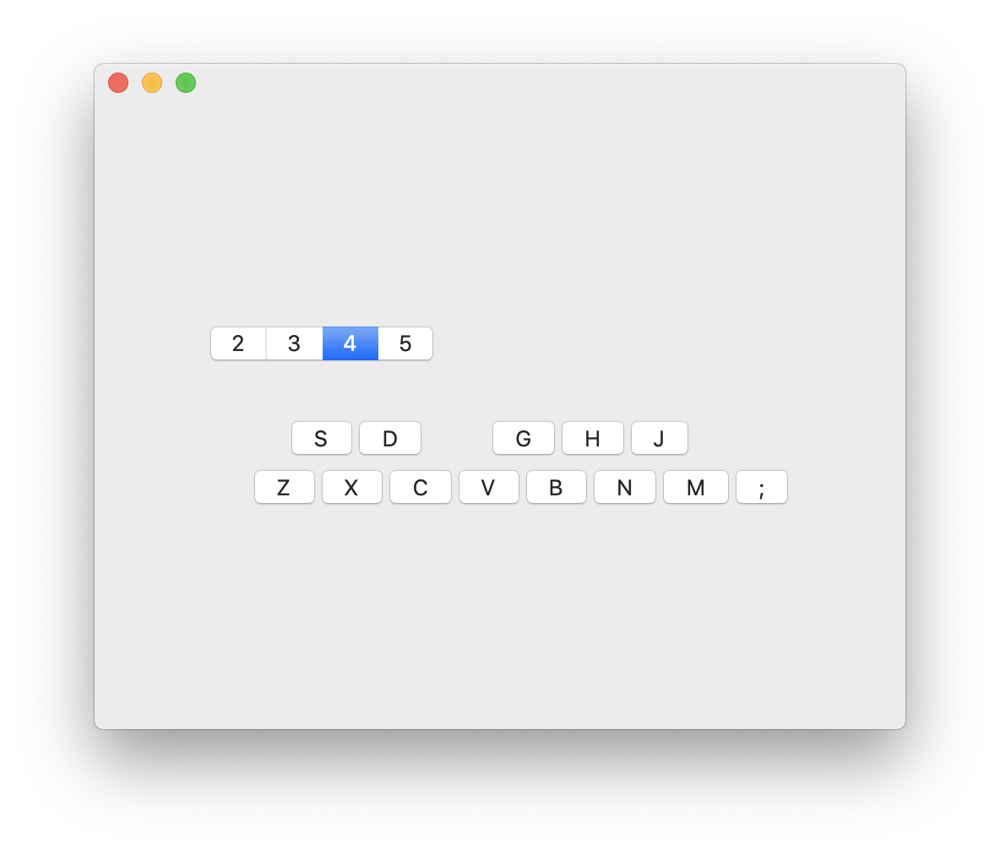

# Chromatics

A simple synthesizer for macOS with keyboard input based on [AudioKit](https://audiokit.io/).

## Build

Xcode 10.2 is required to build. Download [AudioKit.framework](https://github.com/AudioKit/AudioKit/releases/download/v4.7/AudioKit.framework.zip) and then change `FRAMEWORK_SEARCH_PATHS` in `project.pbxproj` to point to the directory where you saved `AudioKit.framework`.
